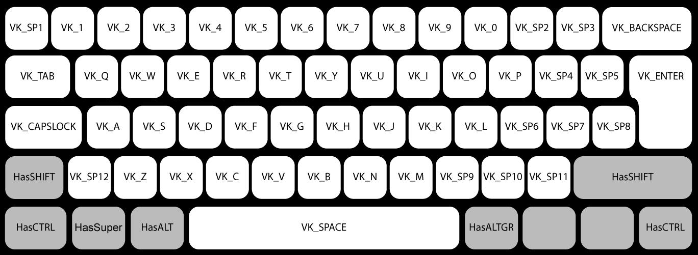

# keybd_event_ex

This library simulates the key press on a keyboard. It runs on Linux, Windows and Mac. It is a personal fork of the library made here: https://github.com/micmonay/keybd_event
Primarily it extends the linux implementation to include key values for mouse button left/right/etc.

**Important :** 
- The keys change in the different keyboard layouts of the target computer(s).

### Example :
```go
package main

import (
	"runtime"
	"time"
	"github.com/blamarche/keybd_event_ex"
)

func main() {
	kb, err := keybd_event_ex.NewKeyBonding()
	if err != nil {
		panic(err)
	}

	// For linux, it is very important to wait 2 seconds
	if runtime.GOOS == "linux" {
		time.Sleep(2 * time.Second)
	}
	
	// Select keys to be pressed
	kb.SetKeys(keybd_event_ex.VK_A, keybd_event_ex.VK_B) 

	// Set shift to be pressed
	kb.HasSHIFT(true) 

	// Press the selected keys
	err = kb.Launching() 
	if err != nil {
		panic(err)
	}
	
	// Or you can use Press and Release
	kb.Press()
	time.Sleep(10 * time.Millisecond)
	kb.Release()

	// Here, the program will generate "ABAB" as if they were pressed on the keyboard.
}
```

For easy access to all the keys on the virtual keyboard, I have added more special keycodes constants `VK_SP*`. 

Below is an illustration showing the "VK_" symbols for each key on the keyboard:


## Linux

On Linux this library uses **uinput**, which on the major distributions requires root permissions. 

The easy solution is executing through root user (by using `sudo`). A worse way is by changing the executable's permissions by using `chmod`.

### Secure Linux Example
```bash
sudo groupadd uinput
sudo usermod -a -G uinput my_username
sudo udevadm control --reload-rules
echo "SUBSYSTEM==\"misc\", KERNEL==\"uinput\", GROUP=\"uinput\", MODE=\"0660\"" | sudo tee /etc/udev/rules.d/uinput.rules
echo uinput | sudo tee /etc/modules-load.d/uinput.conf
```

Another subtlety on Linux: it is important after creating the `keybd_event` to **wait 2 seconds before running first keyboard actions**.

## Darwin (MacOS)
This library depends on Apple's frameworks, and I did not find a solution to cross-compile from another OS to MacOS.
